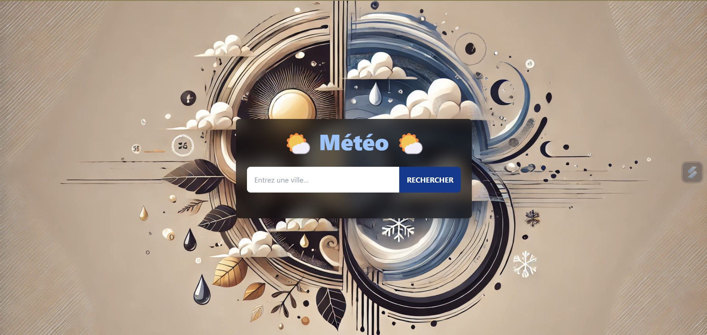
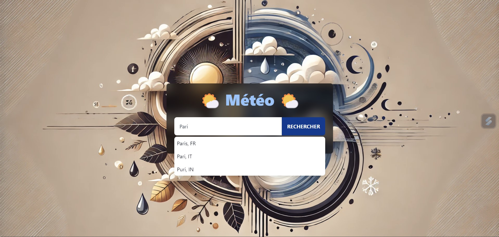
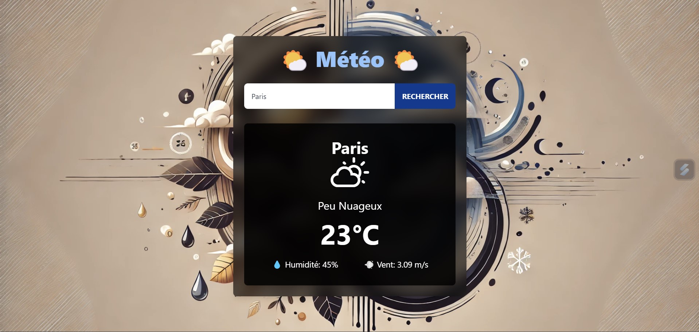
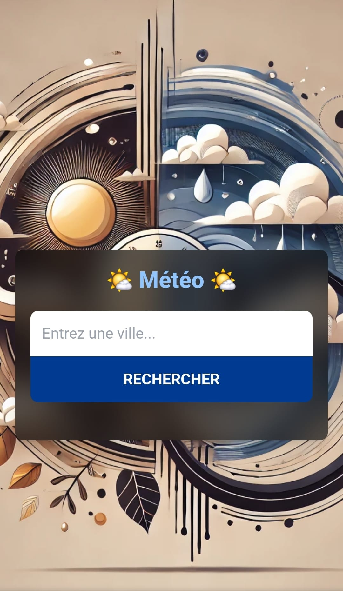
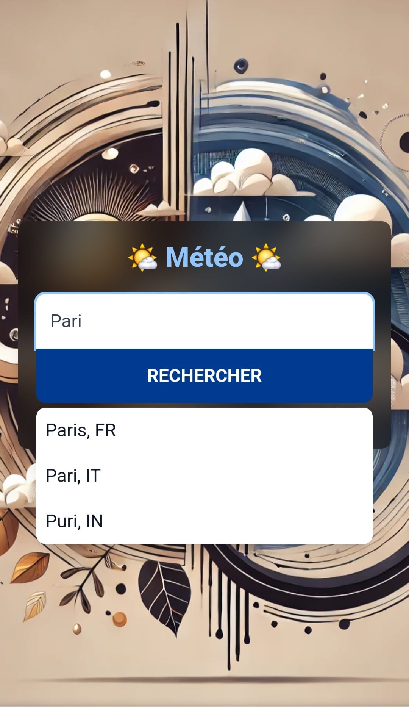
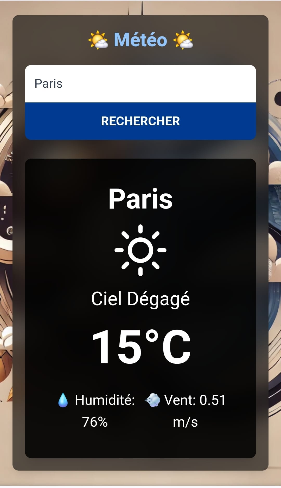

# 🌤️ Météo 🌤️

 

## 📜 Présentation

Bienvenue sur Météo, votre nouvel assistant météo personnel, simple et élégant ! 🌍    

Cette application vous permet de connaître la météo actuelle de n'importe quelle ville dans le monde en un clin d'œil. Vous n'avez qu'à taper le nom de votre ville, et vous obtiendrez instantanément les conditions météorologiques avec une interface épurée et moderne. Fini les surprises avec la météo, soyez toujours prêt(e) à affronter la journée ! 🌞🌧️   

 
 

## ✨ Fonctionnalités Principales

🏙️ Recherche de villes : Saisissez le nom d'une ville et recevez des suggestions instantanées   
📊 Affichage des données météo : Visualisez la température actuelle, l'humidité, la vitesse du vent, et bien plus encore   
📱💻 Interface responsive : Profitez d'une expérience utilisateur fluide sur tous les appareils   
🌈 Icônes dynamiques : Affichage des conditions météo avec des icônes animées pour une meilleure lisibilité   
🗂️ Stockage des données locales : Suivi des requêtes pour optimiser l'expérience utilisateur   

## 📸 Aperçu

Voici à quoi ressemble l'application :   

   

   

   

   

   

   

 
 

[Démo vidéo du projet sur ordinateur 🎥](https://www.youtube.com/watch?v=zGAOJx9SSo8)

[Démo vidéo du projet sur mobile 🎥](https://www.youtube.com/watch?v=ClP1MwEVflw)

 
 

## 🌐 Lien direct

Pour l'utiliser : [Météo🌤️](https://scintillating-cranachan-22bbc3.netlify.app)   

 
 

## 🔧 Technologies Utilisées

⚛️ React : La bibliothèque JavaScript pour construire des interfaces utilisateur dynamiques   
🎨 Tailwind CSS : Un framework CSS pour des styles rapides et flexibles   
🌐 OpenWeatherMap API : Pour obtenir des données météo précises et actualisées   
⚡ Vite : Un outil de build rapide pour le développement moderne de front-end   

 
 

## 📂 Fichiers du Projet

src/hooks/ : Contient tous les hooks personnalisés pour gérer les données météo, les suggestions de villes, etc...   
src/App.jsx : Le composant principal qui orchestre l'application   
src/weather.jsx : Composant pour afficher les données météo   
public/ : Contient les ressources statiques telles que les images et les icônes   

 
 

## 🛠️ Installation et Utilisation

Pour installer et exécuter l'application Météo 🌤️ localement, suivez ces étapes :   

➡️ Clonez le dépôt :   
 
`git clone https://github.com/votre-utilisateur/meteo.git`   

➡️ Accédez au dossier du projet :   

`cd meteo`   

➡️ Installez les dépendances :   

`npm install`   

➡️ Démarrez le serveur de développement :   

`npm run dev`   

➡️ Ouvrez votre navigateur et accédez à http://localhost:5173   

 
 

## 🏗️ Comment Contribuer

Vous souhaitez contribuer ? 🎉 Voici comment faire :   

### Créer une Branche 🌿

➡️ Pour chaque nouvelle fonctionnalité ou correction, créez une nouvelle branche :   

`git checkout -b nom-de-la-branche`   

### Faire vos Changements ✏️   

Apportez les modifications nécessaires et committez-les :   

`git add .`   
`git commit -m "Description des changements"`   

### Pousser les Changements ⬆️   

Envoyez vos modifications à GitHub 📨 :

`git push origin nom-de-la-branche`   

### Créer une Pull Request 🔄   

Allez sur GitHub, ouvrez une Pull Request et expliquez vos modifications   

 
 

## 🤝 Contributeurs/trices

Gabrielle Pagnard 🧑‍💻 - Créatrice du projet

 
 

## 📬 Contact

Pour toute question ou suggestion, n'hésitez pas à me contacter :   

Email : gpagnard@gmail.com   
GitHub : [GabriellePagnard](https://github.com/GabriellePagnard)     

 
 
 

Merci d'avoir pris le temps de visiter ce projet ! 🙌    

  

Si tu as apprécié l'expérience, n'oublie pas de laisser une ⭐ sur le dépôt GitHub, cela me motive à continuer d'améliorer et de créer des projets encore plus magiques à l'avenir ! 🌟